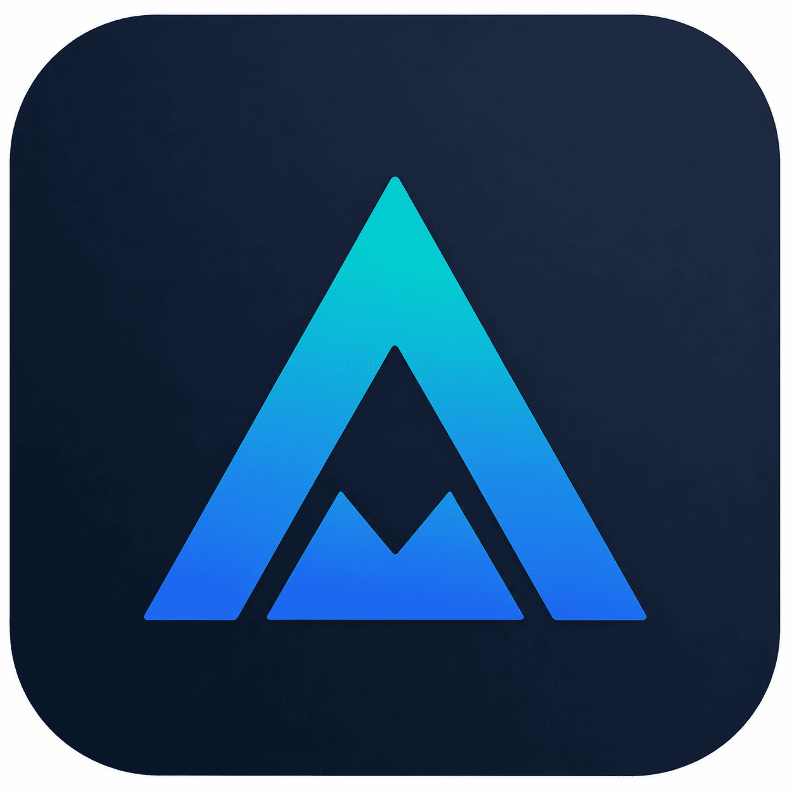
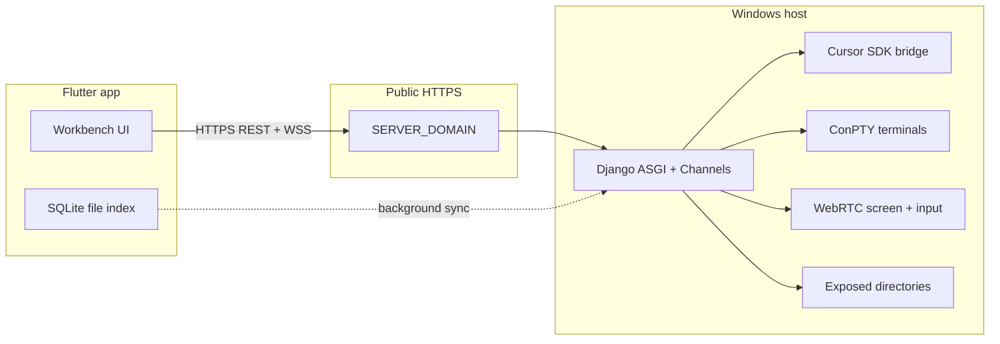

# AI Maxx IDE

<p align="center">
  
</p>

**A self-hosted remote development companion for [Cursor IDE](https://cursor.com).**

Most remote development tools hand over the entire machine — RDP, VNC, full SSH access. That works, but it exposes everything, runs heavy on both ends, and is painful on a mobile screen.

AI Maxx IDE takes a different approach: instead of exposing the machine, it exposes **specific capabilities** — browse configured projects, search the codebase, run AI-assisted workflows, execute terminal commands, and when necessary, take direct control of the screen. Each capability is scoped, intentional, and mobile-first.

| Layer | Stack |
|-------|-------|
| **Frontend** | Flutter — Android & iOS |
| **Backend** | Django ASGI — async WebSocket + HTTP |
| **AI** | Plan Mode (analysis) + Agent Mode (execution), configurable model |
| **Search** | In-memory full-workspace index, synced on startup |
| **Terminal** | Subprocess PTY per tab, streamed over WebSocket |
| **Remote** | Screen stream + mouse/keyboard injection |
| **Tunnel** | [Cloudflare Tunnel](https://developers.cloudflare.com/cloudflare-one/) — internet exposure without open ports |
| **Packaging** | Windows EXE + batch launcher, no Python install required |

**License:** [MIT](./LICENSE) · **Copyright:** Abhijay

---

## Demo

<p align="center">
  <a href="docs/artifacts/demo.mp4">
    
  </a>
  <br />
  <a href="docs/artifacts/demo.mp4"><strong>Watch demo video</strong></a>
  ·
  <a href="docs/reports/AI_Maxx_IDE_Report.pdf">Product report (PDF)</a>
</p>

Full product walkthrough covers project explorer, search, AI assistant (Plan + Agent modes), terminal, remote desktop, and operations dashboard.

---

## Features

### Project explorer & workspace index

Only folders you explicitly configure in `EXPOSED_DIRECTORIES_ABSOLUTE_PATHS` are reachable. Nothing outside those roots is exposed through the app. The workspace index is built on connect and kept in memory for instant search — no filesystem traversal at query time.

### Code search — file & grep

- **File search** — fuzzy filename match (Ctrl+P style)
- **Find / grep** — full-text search across indexed files with line-level results

### AI assistant

- **`@path`** — attach files or folders from the indexed workspace as explicit context
- **`/skills`** — load pre-written instruction sets for recurring tasks
- **Plan Mode** — read, analyse, explain (streaming markdown)
- **Agent Mode** — write files, run commands, execute changes on the host

### Integrated terminal

Each tab is an independent subprocess (real shell, not simulated). Command bar + tap-to-run interaction designed for touchscreens. Full Git workflow from mobile.

### Remote desktop (last resort)

Live screen stream over WebRTC with a separate trackpad and developer shortcut keyboard (Fn row, Ctrl/Alt/Win, navigation keys). Interaction is on dedicated panels, not overlaid on the video — precision on small screens.

### Operations dashboard

Local dashboard at `/dashboard/` to start the Cloudflare tunnel and packaged server, with live status. Two-button setup for self-hosting.

---

## Architecture



| Transport | Base path | Example |
|-----------|-----------|---------|
| REST | `/api/` | `GET /api/workspaces/` |
| WebSocket | `/api/ws/` | `wss://…/api/ws/agent/?api_key=…` |

Auth: `X-API-Key`, `X-Device-Identifier`, `X-Workspace-Id` on REST; same credentials as query params on WebSocket connect.

Deep-dive documentation: [`docs/indexing/full/`](docs/indexing/full/)

---

## Repository layout

```
ai-maxx-ide/
├── app/                    # Flutter mobile client (Android / iOS)
├── server/                 # Django ASGI backend
│   ├── agents/             # Cursor agent WebSocket + bridge
│   ├── ide/                # Route trees, search, file access
│   ├── terminals/          # PTY sessions
│   ├── remote/             # WebRTC remote desktop
│   ├── dashboard/          # Local ops dashboard
│   └── standalone/         # PyInstaller Windows exe packaging
├── scripts/windows/        # Tunnel setup, service starters
├── docs/                   # Design, indexing reference, demo assets
├── sample.env              # Environment template (copy to .env)
├── LICENSE                 # MIT
└── README.md               # ← you are here
```

---

## Quick start

### Prerequisites

- **Windows** workstation (server host; terminals and remote desktop are Windows-oriented)
- **Python 3.12+** and a virtualenv (for development)
- **Flutter SDK** ([install guide](https://docs.flutter.dev/get-started/install))
- **cloudflared** ([Cloudflare Tunnel](https://developers.cloudflare.com/cloudflare-one/connections/connect-networks/downloads/)) for public HTTPS access
- Optional: **Cursor API key** for AI agent features

### 1. Configure environment

```powershell
copy sample.env .env
# Edit .env: SERVER_DOMAIN, API_KEY, SERVER_PORT, EXPOSED_DIRECTORIES_ABSOLUTE_PATHS, CURSOR_API_KEY
```

### 2. Start the server

```powershell
cd server
..\env\Scripts\pip install -r requirements.txt
..\env\Scripts\python manage.py migrate
..\env\Scripts\python manage.py runserver 127.0.0.1:9000
```

Default port is **9000** (`SERVER_PORT` in `.env`). The development server runs ASGI via Daphne (HTTP + WebSockets).

**Packaged exe** (no Python required on the host):

```powershell
cd server\standalone
.\build.bat
# Run: server\standalone\dist\aimaxx-ide\aimaxx-ide.exe
# Dashboard: http://127.0.0.1:9000/dashboard/
```

### 3. Expose via Cloudflare Tunnel

```powershell
scripts\windows\setup_cloudflare_tunnel.bat
scripts\windows\start_services.bat
```

Health check: `https://{SERVER_DOMAIN}/api/health/`

See [`scripts/windows/README.md`](scripts/windows/README.md) and [`docs/commands.txt`](docs/commands.txt) for full command reference.

### 4. Run the mobile app

```powershell
cd app
flutter pub get
flutter run
```

On first launch, authenticate with your server URL and API key (must match `.env` `API_KEY`). See [`app/README.md`](app/README.md) for client-specific setup.

---

## Security model

AI Maxx IDE is designed for **scoped access**, not full-machine remote control:

- Only paths listed in `EXPOSED_DIRECTORIES_ABSOLUTE_PATHS` are browsable
- AI context is explicit (`@path`) — the model does not receive the entire codebase by default
- Remote desktop input can be disabled with `REMOTE_INPUT_ENABLED=false`
- Device registration uses a per-device hash; API key is required on every request

Read [`SECURITY.md`](SECURITY.md) before deploying to production or exposing a tunnel.

---

## Development

```powershell
# Server tests
cd server
python -m pytest

# Flutter analysis & tests
cd app
flutter analyze
flutter test
```

Contributing guidelines: [`CONTRIBUTING.md`](CONTRIBUTING.md)

---

## Documentation

| Document | Description |
|----------|-------------|
| [`docs/indexing/full/README.md`](docs/indexing/full/README.md) | End-to-end system reference |
| [`docs/indexing/full/dart-structure.md`](docs/indexing/full/dart-structure.md) | Flutter app structure |
| [`docs/indexing/full/server.md`](docs/indexing/full/server.md) | Django API & WebSockets |
| [`docs/indexing/full/sync-flow.md`](docs/indexing/full/sync-flow.md) | Workspace indexing over WebSocket |
| [`docs/designs/design.md`](docs/designs/design.md) | VS Code–inspired design language |
| [`docs/third-party-docs/cursor-sdk.md`](docs/third-party-docs/cursor-sdk.md) | Cursor SDK integration notes |
| [`docs/reports/AI_Maxx_IDE_Report.pdf`](docs/reports/AI_Maxx_IDE_Report.pdf) | Product report & screenshots |

---

## License & legal

This project is licensed under the **[MIT License](LICENSE)**.

- **Third-party components:** [`THIRD_PARTY_NOTICES.md`](THIRD_PARTY_NOTICES.md)
- **Security:** [`SECURITY.md`](SECURITY.md)
- **Code of conduct:** [`CODE_OF_CONDUCT.md`](CODE_OF_CONDUCT.md)

Cursor®, Cloudflare®, Flutter®, and Django® are trademarks of their respective owners. This project is an independent open-source implementation and is not affiliated with or endorsed by those organizations.
