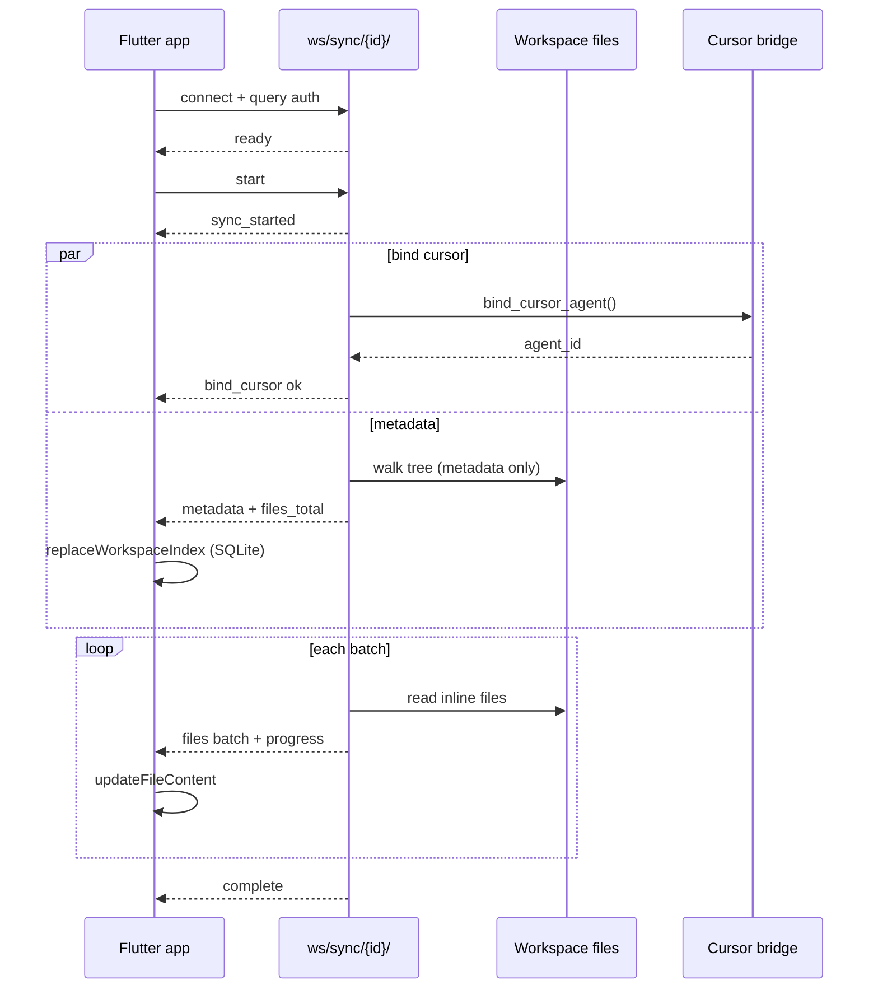

# Workspace Sync Flow (WebSocket)

Indexing mirrors a remote workspace into the mobile SQLite database so the Projects tab can search files offline-style (local index, server-authoritative content).

## Endpoint

```
wss://{SERVER_DOMAIN}/ws/sync/{workspace_id}/?api_key=…&device_hash=…&workspace_id=…
```

Auth uses the same query parameters as other Channels consumers (`core/ws_auth.py` middleware).

## Protocol

### Client → server

| `type` | When |
|--------|------|
| `start` | Begin sync after `ready` |
| `cancel` | Abort in-flight sync |

### Server → client

| `type` | Payload | Meaning |
|--------|---------|---------|
| `ready` | `workspace_id` | Connection accepted |
| `sync_started` | `workspace_id` | Sync task began |
| `bind_cursor` | `status`, `agent_id?`, `message?` | Cursor agent bind result (parallel, optional) |
| `metadata` | `tree`, `files_total`, `sync_summary` | Full directory tree, **no file bodies** |
| `files` | `files[]`, `skipped[]`, `files_done`, `files_total` | Inline file batch (≤32 paths) |
| `complete` | `sync_summary` | Done |
| `error` | `code`, `message` | Fatal |

## Phases



## Sync policies

Configured in `server/config/settings.py`:

| Setting | Default | Effect |
|---------|---------|--------|
| `FILE_SYNC_INLINE_MAX_BYTES` | 1_048_576 (1 MiB) | Files ≤ this get `sync_policy: inline` |
| `SYNC_FILES_BATCH_MAX_PATHS` | 32 | Max paths per `files` frame |

Larger files are indexed as `metadata_only` (path, size, name — no content over the wire).

## Why WebSocket instead of HTTP

| Problem (HTTP) | WS fix |
|----------------|--------|
| `POST /sync/` held connection open with one giant JSON response | Metadata sent once; bodies streamed in batches |
| Separate `POST /bind-cursor/` + `POST /sync/` = 2 connections | Single session; bind-cursor is a side message |
| Client polled batches via `POST /sync/files/` | Server pushes batches with `files_done` / `files_total` |
| Blocked UI perception | `start()` is fire-and-forget; progress in header |

## Server implementation

| File | Role |
|------|------|
| `server/files/consumers.py` | `WorkspaceSyncConsumer` |
| `server/files/sync_service.py` | Shared tree build + file batch fetch |
| `server/files/tree.py` | `build_sync_tree`, `attach_sync_summary` |
| `server/config/routing.py` | `ws/sync/<int:workspace_id>/` |

REST handlers in `server/files/views.py` delegate to `sync_service` for tests.

## Client implementation

| File | Role |
|------|------|
| `app/lib/core/ws/ws_client.dart` | Connect, auth query, JSON frames |
| `app/lib/core/sync/workspace_sync_service.dart` | State machine for sync phases |
| `app/lib/core/providers/sync_provider.dart` | Riverpod notifier, background run |

## Tests

```bash
cd server
pytest tests/test_sync_ws.py tests/test_files.py -q
```

`test_sync_ws.py` verifies metadata + file batches + complete over a real Channels communicator.

## Failure modes

| Code | Cause |
|------|-------|
| WS close 4401 | Missing/invalid auth |
| WS close 4403 | Query `workspace_id` ≠ path `workspace_id` |
| WS close 4404 | Workspace not found for device |
| `not_found` | Workspace directory missing on server |
| `cursor_unavailable` | `CURSOR_API_KEY` unset (bind_cursor only; sync continues) |
| `connection_closed` | Tunnel drop or server restart mid-sync — re-open workspace to resync |
