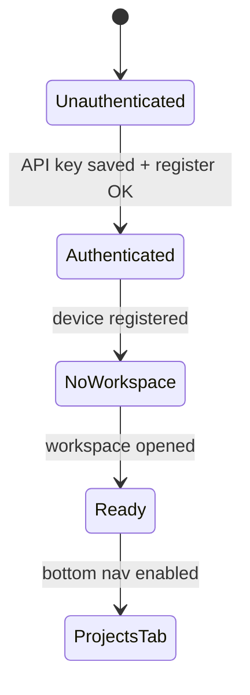

# Flutter app definition

Mobile IDE client implementing [wireframes_v4.html](../wireframes/wireframes_v4.html) with the visual language from [design.md](../designs/design.md). Connects to the Django backend defined in [backend.md](./backend.md).

## Product summary

A VS Code–inspired dark workbench on phone/tablet that:

1. Authenticates with API key + device fingerprint.
2. Requires workspace selection before main IDE tabs unlock.
3. Searches files locally (synced index) with server fallback.
4. Streams Cursor agent responses in the Projects tab.
5. Manages local shell terminals on the Terminals tab (REST + WebSocket).
6. Views and controls the Windows desktop on the Remote tab.
7. Opens hamburger panels for workspace tree + git operations.

## Architecture

```
lib/
├── main.dart
├── app.dart                    # MaterialApp + theme + router
├── theme/                      # design.md → ThemeExtension
├── core/
│   ├── config/app_config.dart  # SERVER_DOMAIN, keys from secure storage
│   ├── api/api_client.dart     # dio + interceptors
│   ├── ws/ws_client.dart
│   ├── auth/auth_repository.dart
│   ├── db/app_database.dart      # sqflite
│   └── device_identifier.dart
├── routing/app_router.dart       # go_router
└── features/
    ├── shell/                    # Scaffold + bottom nav
    ├── onboarding/               # auth + workspace gate
    ├── menu/                     # hamburger workspace + git
    ├── projects/
    ├── terminals/
    └── remote/
```

### State management

| Layer | Package | Usage |
| --- | --- | --- |
| DI | `riverpod` or `provider` | Repositories, WS clients |
| Navigation | `go_router` | Tab + full-screen menu routes |
| Local DB | `sqflite` + `drift` (optional) | API key, workspace id, file index |
| Secure storage | `flutter_secure_storage` | API key preference |

Keep feature folders **vertical** (UI + controller + repository).

## Design system implementation

Map [design.md](../designs/design.md) tokens to `WorkbenchTheme` `ThemeExtension`:

| Token | Flutter mapping |
| --- | --- |
| `bg.app` / `bg.chrome` | `Color(0xFF181818)` scaffold, app bar |
| `bg.canvas` | `Color(0xFF1F1F1F)` editor/terminal surfaces |
| `bg.elevated` | `Color(0xFF222222)` cards, composer |
| `bg.input` | `Color(0xFF313131)` fields, chips |
| `accent.primary` | `Color(0xFF0078D4)` active tab top border, CTAs |
| `fg.*` | `TextTheme` body/label colors |
| `ai.*` | Dedicated `AiPanelColors` extension |

### Typography

| Role | Font | Size |
| --- | --- | --- |
| UI | `system-ui` stack via bundled **Ubuntu** + `ThemeData(fontFamily: ...)` | 12–14 sp |
| Code | **Ubuntu Mono** (Google Fonts CDN bundled) | 13–15 sp, height 1.5 |

Match wireframes_v4: workbench UI font stack from design.md § Exact default fonts.

### Icons

| Layer | Implementation |
| --- | --- |
| Workbench chrome | **Codicons** — vendor `codicon.ttf` from `@vscode/codicons` npm package; Dart `IconData` map (wireframe codepoints: menu `0xeb94`, search `0xea6d`, etc.) |
| File tree | `vscode_material_icon_theme` or `symbols_icon_pack` |

Do not mix unrelated icon packs in shell chrome (per design.md).

### Shared widgets

| Widget | Spec |
| --- | --- |
| `WorkbenchScaffold` | Status padding, header 44dp, bottom nav 30dp + 2dp active border |
| `WorkbenchSearchField` | `bg.input`, leading codicon search, trailing close/stop |
| `SegmentedToggle` | File search / grep |
| `SidebarTreeRow` | 32dp height, optional 3dp accent bar |
| `ComposerCard` | 8dp radius, elevated surface, footer chips |
| `DestructiveIconButton` | `status.error` for discard/x |
| `SuccessIconButton` | `status.success` for commit/check |

Touch targets: minimum 44dp (design accessibility).

## Onboarding gate (critical path)

Until both conditions met, **shell shows menu-first layout**:



### Authenticate modal

- Trigger: banner button “Authenticate” in hamburger/header.
- UI: modal bottom sheet, single `TextField` (obscured) for API key paste, **Login** primary button.
- On submit:
  1. `POST /api/devices/register/` with `X-API-Key` + computed hash + device `data` JSON.
  2. Persist API key in `flutter_secure_storage` + `sqflite` session row.
  3. Close modal; refresh menu.

### Workspace selection (hamburger menu)

Matches **Screen 4** before workspace exists:

1. **Searchable dropdown** of existing workspaces (`GET /api/workspaces/`).
2. **Directory tree** from `GET /api/files/roots/` → drill-down via `GET /api/files/by-path/?path=`.
3. **Open workspace** button → `POST /api/workspaces/` → `POST .../bind-cursor/`.
4. Kickoff `POST /api/workspaces/{id}/sync/` in background isolates.

Only after success: enable Projects / Terminals / Remote tabs.

## Screen map

| Wireframe | Route | Feature module |
| --- | --- | --- |
| 1 Projects | `/projects` | `features/projects` |
| 2 Terminals | `/terminals` | `features/terminals` |
| 3 Remote | `/remote` | `features/remote` |
| 4 Workspace menu | `/menu/workspace` | `features/menu/workspace` |
| 5 Git menu | `/menu/git` | `features/menu/git` |

Hamburger opens full-screen `menu` overlay; close returns to prior tab.

---

## Screen 1 — Projects (search + agent)

### Header

- Codicon menu → workspace/git menu.
- Search field; close clears query; stop cancels agent run (`POST /agent/stop/` + WS).

### File search / grep toggle

| Mode | Data source |
| --- | --- |
| File search | Local SQLite `files` table (synced tree); fallback REST `/search/files/` |
| Grep | Local: spawn `rg`/`grep` via `process` on cached paths under 1MB; else `POST /search/grep/` |

### Result list (GitHub-style)

- Monospace path, line range badge (`L1-42`).
- **Long-press** enters selection mode.
- **Range select:** tap row A, tap row B → select inclusive range (GitHub mobile pattern).
- **Select all** in app bar when viewing single file's matches.
- **Reference tick:** confirm → insert `@path:line_start-line_end` into composer.

### Layout behaviors (wireframe Working)

| State | Layout |
| --- | --- |
| Normal | Results ~40%, agent panel ~flex |
| Searching (Projects tab) | Results ~60vh, composer only at bottom |
| File reference mode | Agent ~60%, search bar only at top |

### Cursor responses panel

Render streamed WS events:

| Event type | UI block |
| --- | --- |
| Assistant text | flat row on `bg.canvas` |
| File edit | chip `parser.cpp ~modified` in `ai.editedFileFg` |
| Tool command | `ai.commandBg` block, monospace |
| Streaming | partial text + accent caret |

### Composer

- Placeholder: “Plan, Build, / for skills, @ for context”.
- Footer: ∞ context pill, Auto ⌄ model selector (future), attach + mic codicons.
- Send → `WS /ws/agent/` `message` frame.
- `@` opens file picker referencing synced tree.

---

## Screen 2 — Terminals

- Composer **hidden** (dashed placeholder per wireframe).
- Main: `GhosttyTerminalView` or `xterm` bound to `WS /ws/terminals/{id}/`.
- Selected terminal bar: green dot, label, + new, trash delete.
- Session list: alternating `bg.canvas` / `bg.chrome` rows.
- **Create:** `POST /api/terminals/` → open WebSocket on returned `id`.
- **Delete:** `DELETE /api/terminals/{id}/` from trash icon.
- Server spawns local PowerShell/cmd in workspace `cwd`; no external SSH.
- Reconnect: same `id` reattaches if PTY still running.

---

## Screen 3 — Remote

### Top ~50% — Desktop video

- `flutter_webrtc` `RTCVideoRenderer` subscribed to server screen track.
- Signaling over `WS /ws/remote/` (offer/answer/ICE).
- Pointer overlay optional (server draws cursor in frame).

### Bottom ~50% — Controls

Sub-tabs: **Trackpad** | **Keyboard** (2dp top accent on active).

**Trackpad tab**

- `Listener`/`GestureDetector` on surface: move, tap, two-finger scroll.
- Left / Right click buttons → enqueue pointer events.

**Keyboard tab**

- Staging area for combos (Fn / $# / 123 layers).
- **x** clears staging → WS `{ "clear": true }`.
- **+** appends to staging without dispatch.
- **✓** sends `{ "dispatch": true, "events": [...] }`.

---

## Screen 4 — Workspace menu

- Tab strip: Workspace (active) | Git.
- Close (x) dismisses menu.
- Git graph shortcut icon → switch to Git tab.
- Workspace dropdown + recent list (local cache of `GET /workspaces/`).
- Tree: monospace paths; folders highlighted `ai.editedFileFg` for emphasis.
- Path field + Select / + New folder / + New file → REST file ops.

---

## Screen 5 — Git menu

Wire to [backend.md](./backend.md) git routes:

- Commit message + ✓ Commit button.
- Quick actions: Add, Stash, Discard (error color), Commit, Sync.
- Changed files list with `M/A/D` coloring; `+ ⏎` stage row.
- Command input → `POST /git/exec/` on ⏎.
- Branch dropdown + **Select** → `POST /git/checkout/`.
- Commit history vertical graph.

---

## Local data layer

### SQLite tables

| Table | Purpose |
| --- | --- |
| `settings` | `api_key`, `server_url`, `active_workspace_id` |
| `files` | `workspace_id`, `path`, `name`, `size`, `hash`, `content` (nullable), `synced_at` |
| `grep_cache` | optional full-text for small files |

### Background sync worker

On workspace open:

1. `sync_workspace` → walk tree.
2. Download files ≤ 1 MB in parallel (cap 4).
3. Store metadata only for larger files.
4. When user selects large file in search, show confirm dialog → `GET /files/download/`.

### Local search pipeline

```
User types query
  → debounce 200ms
  → if file mode: SQL LIKE on files.name/path
  → if grep mode: ripgrep on cached content paths
  → if sparse index: REST fallback
```

Use `process` package for `rg` on Android (bundled binary) / desktop; on iOS grep mode may be server-only unless sandbox permits.

## API client conventions

```dart
dio.options.headers['X-API-Key'] = apiKey;
dio.options.headers['X-Device-Identifier'] = deviceHash;
dio.options.headers['X-Workspace-Id'] = workspaceId;
```

WebSocket URL: `wss://{SERVER_DOMAIN}/ws/...` (from env / user settings).

## Accessibility

- All icon-only controls: `Tooltip` + `Semantics(label: ...)`.
- Active tab: color + 2dp border (not color alone).
- Terminal output: monospace, success lines in `status.success`.

## Testing

| Type | Target |
| --- | --- |
| Widget | `SegmentedToggle`, `SidebarTreeRow`, composer |
| Golden | Dark theme snapshots per screen |
| Integration | Mock WS agent stream |

## v1 exclusions

- On-device code editing (read/search/reference only).
- Offline agent (requires server).
- Multi-workspace simultaneous tabs.
