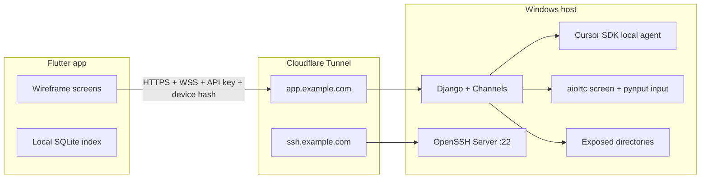

# Repository structure plan

Definition document for the **ai-maxx-ide** monorepo. This file is the source of truth for top-level layout, deployment boundaries, and how the mobile client talks to the Windows-hosted backend.

## Intent

A Windows workstation runs the **server** (Django + Channels + Cursor SDK + remote desktop). A **Flutter mobile app** connects over HTTPS/WSS through a **Cloudflare Tunnel**. Local setup scripts live under `scripts/windows/`. Container packaging lives under `docker/`.

```
ai-maxx-ide/
├── app/                          # Flutter mobile IDE client
├── server/                       # Django ASGI backend (API + WebSockets)
├── docker/                       # Compose, images, deployment helpers
├── scripts/
│   └── windows/
│       ├── setup_cloudflare_tunnel.bat  # Windows entry point (run as admin)
│       ├── setup_cloudflare_tunnel.py   # Cloudflare + SSH bootstrap logic
│       └── README.md
├── docs/
│   ├── designs/design.md         # Visual language (VS Code dark workbench)
│   ├── wireframes/wireframes_v4.html
│   ├── third-party-docs/cursor-sdk.md
│   └── plan/                     # ← implementation definitions (this folder)
├── sample.env                      # Env template — copy to .env (never commit .env)
├── .gitignore
```

## Runtime topology



| Surface | Protocol | Purpose |
| --- | --- | --- |
| REST API | HTTPS | Auth, workspaces, files, git, search proxy |
| Agent socket | WSS | Cursor agent message stream |
| Remote socket | WSS + WebRTC | Screen relay signaling + input events |
| Terminal socket | WSS | PTY sessions (local shell + SSH-backed) |
| SSH (optional) | TCP via Cloudflare | Direct terminal access from dev machines |

## `scripts/windows/`

### `setup_cloudflare_tunnel.bat`

Windows entry point. Double-click or run from cmd; re-launches elevated when needed (OpenSSH + machine `PATH` require admin). Resolves Python 3.10+ via `py -3` or `python`, then runs `setup_cloudflare_tunnel.py`.

### `setup_cloudflare_tunnel.py`

Rerun-safe bootstrap logic (invoked by the `.bat` file). Reads **`{repo}/.env`** (copy from `sample.env`). No interactive domain prompts.

**Tunnel hostnames (default: 2 + optional extras):**

| Source in `.env` | Tunnel ingress |
| --- | --- |
| `SERVER_DOMAIN` | `http://127.0.0.1:{LOCAL_SERVER_PORT}` (Django API + WSS) |
| `SSH_DOMAIN` | `ssh://localhost:22` |
| `TUNNEL_EXTRA_INGRESS` (JSON array) | Additional `{hostname, service}` pairs |

DNS routes are created for **every** ingress hostname. Responsibilities:

1. Download/install `cloudflared.exe` to `C:\cloudflared` and append to machine `PATH`.
2. Ensure **OpenSSH Server** on Windows (install capability, start `sshd`, firewall rule on 22).
3. Interactive Cloudflare login (`cloudflared tunnel login`) if `~/.cloudflared/cert.pem` missing.
4. Create named tunnel (`TUNNEL_NAME` from `.env`) + write `~/.cloudflared/config.yml` from `.env` hostnames.
5. DNS routes for each ingress hostname.
6. Optional Windows service install when `INSTALL_CLOUDFLARED_SERVICE=true`.
7. Optional SSH client config when `SSH_USERNAME` is set (`ProxyCommand cloudflared access ssh`).
8. Optional Flask smoke-test `scripts/windows/app.py` when `SKIP_FLASK_SMOKE_TEST=false`.

**Production note:** Django binds `127.0.0.1:{LOCAL_SERVER_PORT}` (default `8000`). Same `.env` keys are used by `server/` later.

### Future scripts (not in scope yet)

| Script | Purpose |
| --- | --- |
| `install_server.ps1` | venv, pip install, migrate, collectstatic |
| `register_device.ps1` | Admin helper to approve a device hash |
| `run_dev.ps1` | uvicorn/daphne + cloudflared in one dev session |

## `docker/`

Docker is for **repeatable server deployment** on Windows/Linux hosts that support containers. The mobile app does not run in Docker.

```
docker/
├── Dockerfile.server          # Python 3.12 slim + server deps + cursor-sdk bridge
├── docker-compose.yml         # server + redis (channel layer) + optional coturn
├── .env.docker.example
└── README.md
```

| Service | Image / role |
| --- | --- |
| `server` | Django ASGI via `uvicorn server.asgi:application` |
| `redis` | Django Channels layer + session cache |
| `coturn` (optional) | TURN for WebRTC when symmetric NAT blocks P2P |

**Windows host reality:** Screen capture (`mss`) and input injection (`pynput`) require host desktop access. For full Remote tab fidelity, run the server **on the bare Windows machine** (or a Windows VM with GPU/desktop session), not inside a headless Linux container. Docker profile is best for API-only dev or Linux staging without remote desktop.

## `server/`

```
server/
├── manage.py
├── pyproject.toml              # or requirements.txt
├── .env.example
├── config/
│   ├── settings/
│   │   ├── base.py
│   │   ├── local.py
│   │   └── production.py
│   ├── asgi.py                 # ProtocolTypeRouter: HTTP + WebSocket
│   ├── urls.py
│   └── wsgi.py                 # unused in production; ASGI only
├── core/
│   ├── middleware.py           # API key + device hash gate
│   ├── authentication.py       # DRF auth classes
│   ├── models.py               # DeviceIdentifier, Workspace, AgentMessage
│   ├── permissions.py
│   └── utils/
│       ├── paths.py            # exposed directory validation
│       └── hashing.py
├── agents/
│   ├── consumers.py            # Agent WebSocket consumer
│   ├── cursor_bridge.py        # cursor-sdk AsyncClient wrapper
│   └── serializers.py
├── files/
│   ├── views.py                # files_by_path, sync_workspace, file download
│   └── tree.py
├── gitapp/
│   ├── views.py                # status, stage, commit, branches, log
│   └── runner.py               # subprocess git with workspace cwd
├── terminals/
│   ├── consumers.py            # PTY WebSocket
│   └── ssh.py                  # SSH session spawn + auto cd
├── remote/
│   ├── consumers.py            # WebRTC signaling + input WS
│   ├── screen.py               # mss + aiortc VideoStreamTrack
│   └── input_executor.py       # pynput combo execution
└── tests/
```

### Server `.env` (required keys)

Copy `sample.env` → `.env` at repo root. Tunnel setup and Django share this file.

| Variable | Used by | Description |
| --- | --- | --- |
| `SERVER_DOMAIN` | tunnel, app, server | Full public API hostname (e.g. `app.example.com`) |
| `SSH_DOMAIN` | tunnel, server | Full public SSH hostname (e.g. `ssh.example.com`) |
| `TUNNEL_NAME` | tunnel | cloudflared tunnel name |
| `LOCAL_SERVER_PORT` | tunnel, server | Local bind port (default `8000`) |
| `TUNNEL_EXTRA_INGRESS` | tunnel | Optional JSON `[{hostname, service}, ...]` |
| `SSH_USERNAME` | tunnel | Optional `~/.ssh/config` entry for `SSH_DOMAIN` |
| `INSTALL_CLOUDFLARED_SERVICE` | tunnel | `true` to install cloudflared as Windows service |
| `SKIP_FLASK_SMOKE_TEST` | tunnel | `true` (default) skips Flask smoke-test app |
| `CURSOR_API_KEY` | server | Cursor SDK user/service key |
| `API_KEY` | server | Shared secret mobile clients send as `X-API-Key` |
| `EXPOSED_DIRECTORIES_ABSOLUTE_PATHS` | server | JSON array of allowed workspace roots |
| `DJANGO_SECRET_KEY` | server | Standard Django secret |
| `REDIS_URL` | server | Channels layer (if not in-memory dev) |
| `DATABASE_URL` | server | SQLite dev; Postgres prod optional |

## `app/`

```
app/
├── pubspec.yaml
├── lib/
│   ├── main.dart
│   ├── theme/
│   │   ├── workbench_theme.dart    # maps design.md tokens
│   │   ├── typography.dart
│   │   └── codicons.dart           # vendored font + icon map
│   ├── core/
│   │   ├── api/                    # REST client (dio)
│   │   ├── ws/                     # WebSocket base + reconnect
│   │   ├── auth/                   # API key + device registration
│   │   ├── db/                     # sqflite settings + file index
│   │   └── device_identifier.dart  # SHA-256 hardware hash
│   ├── features/
│   │   ├── shell/                  # bottom nav, hamburger gate
│   │   ├── auth/                   # API key modal
│   │   ├── workspace/              # menu, tree, open workspace
│   │   ├── projects/               # Screen 1: search, agent, composer
│   │   ├── terminals/              # Screen 2
│   │   ├── remote/                 # Screen 3
│   │   └── menu/                   # Screens 4–5 workspace + git
│   └── widgets/                    # shared workbench components
├── assets/
│   ├── fonts/
│   │   ├── codicon.ttf
│   │   └── UbuntuMono-Regular.ttf
│   └── icons/                      # optional file icon theme assets
└── test/
```

## Cross-cutting concerns

### Authentication model

Every HTTP and WebSocket request carries:

| Header / param | Value |
| --- | --- |
| `X-API-Key` | Server `API_KEY` |
| `X-Device-Identifier` | SHA-256 hash from Flutter `getSystemHashIdentifier()` |

Device must be registered via `POST /api/devices/register/` before other endpoints succeed.

### Workspace gate (app UX)

Until **authenticated** and **workspace selected**, the shell shows:

1. Hamburger menu only (workspace picker + directory tree).
2. Blocking **Authenticate** affordance (API key modal).
3. No Projects search/agent, Terminals, or Remote tabs in active state.

After `POST /api/workspaces/` + client-side Cursor workspace bind, enable full tab strip per wireframes.

### File sync policy

| Size | Behavior |
| --- | --- |
| ≤ 1 MB | Background sync into local SQLite cache on workspace open |
| > 1 MB | Metadata only locally; explicit user confirm in search UI before download |

### Search strategy

| Mode | Primary | Fallback |
| --- | --- | --- |
| File name search | Local SQLite index (synced tree) | `GET /api/search/files?q=` |
| Grep | Local ripgrep/grep via `process` if indexed content exists | `POST /api/search/grep` on server |

### Reference documents

| Doc | Role |
| --- | --- |
| [design.md](../designs/design.md) | Color, typography, component language |
| [wireframes_v4.html](../wireframes/wireframes_v4.html) | Per-screen design + working behavior |
| [cursor-sdk.md](../third-party-docs/cursor-sdk.md) | Agent streaming API |
| [backend.md](./backend.md) | API + WebSocket contracts |
| [app.md](./app.md) | Flutter screen implementation |
| [package-docs.md](./package-docs.md) | Dependency choices |

## Implementation phases

| Phase | Deliverable |
| --- | --- |
| P0 | `scripts/windows` tunnel + Django skeleton + device auth |
| P1 | Workspace/files/git REST + hamburger menu in Flutter |
| P2 | Agent WebSocket + Projects tab composer |
| P3 | Terminals PTY + SSH |
| P4 | Remote WebRTC screen + input staging |
| P5 | Local search index + grep + file reference UX |
